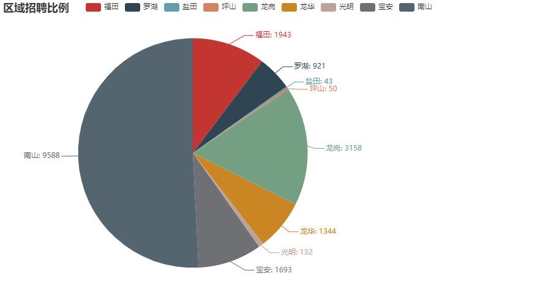
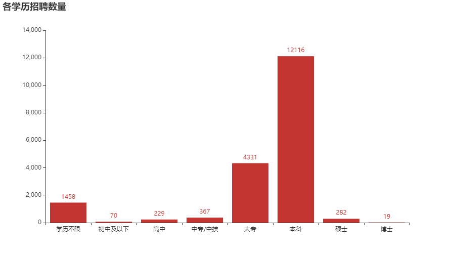
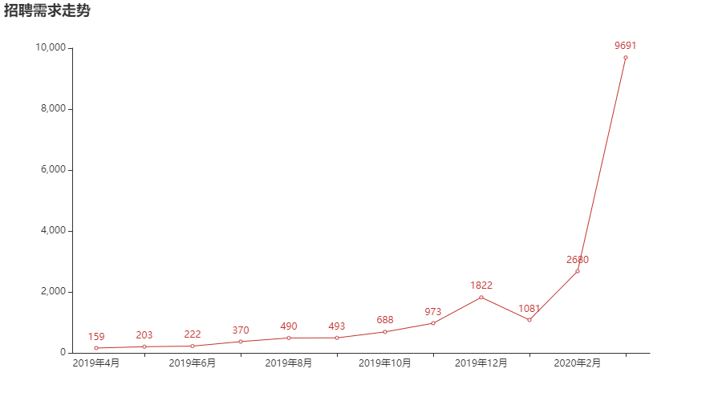
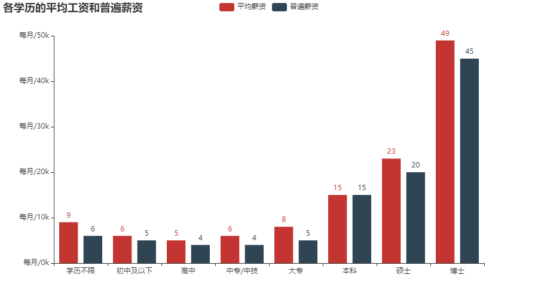

##工作供给数量分析（Sat Mar 21 17:09:04 2020）

1. 数据采集自BOSS平台
2. 采集方法——获取公司职位主页——获取职位详细链接——获取详细信息
3. 由于BOSS采用了JS加密，在cookie里加了\_\_zp\_stoken\_\_的令牌检测，所以采用了selenium
4. 爬取了深圳地区的职位信息,一共1.8W+个,不得不说selenium真的好用，但是效率真的好低
5. 采用pandas+pyecharts对数据进行分析和清洗,得出以下结果

* 南山的工作供给是最多的
* 盐田的工作供给是最少的
* 大部分公司普遍都集中在南山

* 大部分公司普遍要求招聘者是本科学历
* 学历越低越有可能找不到工作，因为供给的数量太少了

* 市场的工作供给数量呈上升趋势(也有可能是抓来的数据本身就存在问题)

* 学历越高工资越多
* 平均工资的确是被高工资人群给拉高的(因为普遍薪资的数据指标采用的是"众数")

**程序执行流程**

1. get_company_link.py获取公司主页
2. get_detail_link.py获取职位详细链接
3. get_detail_information.py获取职位详细信息
4. Cleaning_sorting.py对数据进行清洗分类
5. Final_analysis.py做最后的分析处理

